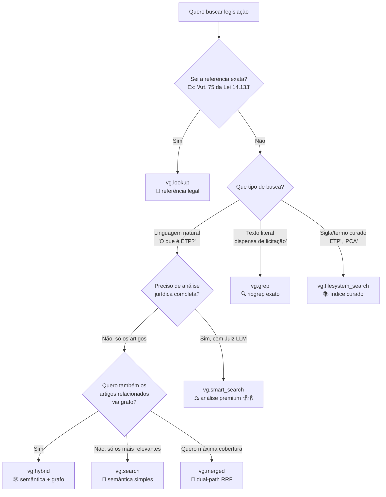

# VectorGov SDK

**Busca semântica em legislação brasileira em 3 linhas de Python.**

Acesse leis, decretos e instruções normativas com chunks prontos para alimentar qualquer LLM (OpenAI, Claude, Gemini, Ollama, LangChain, MCP).

[](https://badge.fury.io/py/vectorgov)
[](https://www.python.org/downloads/)
[](https://opensource.org/licenses/MIT)

> **Novidades**:
> - **0.19.6** — ⚠️ BREAKING: `vg.store_response()` removido (endpoint descontinuado). Use `result.query_id` direto em `vg.feedback()` ([CHANGELOG](CHANGELOG.md#0196---2026-04-15))
> - **0.19.5** — `to_context()` e builders XML/markdown usam `citation` no formato jurídico
> - **0.19.4** — campo `citation` em todos os Result types (`Art. 75 da Lei 14.133/2021`) — pronto para LLMs
> - **0.19.2** — créditos em todos os 8 endpoints pagos
> - **0.19.0** — IDs internos de implementação removidos do response público

---

## ⚡ Quickstart (2 minutos)

```bash
pip install vectorgov
export VECTORGOV_API_KEY=vg_sua_chave
```

```python
from vectorgov import VectorGov

vg = VectorGov()  # lê VECTORGOV_API_KEY da env

result = vg.search("Quando o ETP pode ser dispensado?")

for hit in result:
    label = hit.citation or hit.source  # citation é o formato jurídico (0.19.4+)
    print(f"[{hit.score:.0%}] {label}")
    print(hit.text[:200], "...\n")
```

```
[97%] Art. 18 da Lei 14.133/2021
Art. 18. A fase preparatória do processo licitatório é caracterizada pelo planejamento ...

[92%] Art. 14 da IN 58/2022
Art. 14. A elaboração do ETP: I - é facultada nas hipóteses dos incisos I, II, VII e VIII ...
```

**Próximo passo**: passar para o seu LLM (3 linhas):

```python
from openai import OpenAI
client = OpenAI()
response = client.chat.completions.create(
    model="gpt-4o-mini",
    messages=result.to_messages(query="Quando o ETP pode ser dispensado?"),
)
print(response.choices[0].message.content)
```

> 🤖 **Para LLMs e agentes**: este README + a [single-page LLM reference](docs/llm-reference.md) foram desenhados para serem alimentados a agentes via curl. O campo `hit.citation` (formato jurídico brasileiro `Art. 75 da Lei 14.133/2021`) é o identificador que o seu agente deve usar nas respostas.

---

## 🌳 Qual método usar?



| Método | Latência | Custo | Pra que serve |
|---|---|---|---|
| `vg.search()` | 2-7s | 💰 | Busca semântica simples — chat, RAG, autocomplete |
| `vg.smart_search()` | 5-18s | 💰💰 | Análise jurídica completa com Juiz LLM |
| `vg.hybrid()` | 3-10s | 💰 | Semântica + expansão por grafo de citações |
| `vg.merged()` | 2-5s | 💰 | Dual-path: hybrid + filesystem com RRF |
| `vg.lookup()` | < 1s | 💰 | Resolve "Art. 75 da Lei 14.133" para o dispositivo |
| `vg.grep()` | < 1s | 💰 | Busca textual literal (ripgrep) |
| `vg.filesystem_search()` | < 1s | 💰 | Índice curado (siglas, termos técnicos) |
| `vg.read_canonical()` | < 1s | **free** | Lê texto canônico completo |

> 🧭 **Decisão por caso de uso**: veja a [Cheat Sheet](docs/cheat-sheet.md) — 1 página com decision tree completa, comparações e padrões idiomáticos.

---

## 📋 Os 22 métodos do SDK

### 🔍 Busca (8)

| Método | O que faz |
|---|---|
| [`search`](docs/api/methods.md#search) | Busca semântica simples (3 modos: fast/balanced/precise) |
| [`smart_search`](docs/api/methods.md#smart_search) | Análise jurídica completa com Juiz LLM (Premium 💰💰) |
| [`hybrid`](docs/api/methods.md#hybrid) | Semântica + expansão por grafo de citações |
| [`lookup`](docs/api/methods.md#lookup) | Resolve referência legal → dispositivo exato |
| [`grep`](docs/api/methods.md#grep) | Busca textual literal (ripgrep) |
| [`filesystem_search`](docs/api/methods.md#filesystem_search) | Índice curado determinístico |
| [`merged`](docs/api/methods.md#merged) | hybrid + filesystem unificados via RRF |
| [`read_canonical`](docs/api/methods.md#read_canonical) | Lê texto canônico completo (free) |

### 🤖 Function Calling (4) — para agentes LLM

| Método | O que faz |
|---|---|
| [`to_openai_tool`](docs/api/methods.md#to_openai_tool) | Gera tool no formato OpenAI Function Calling |
| [`to_anthropic_tool`](docs/api/methods.md#to_anthropic_tool) | Gera tool no formato Anthropic Claude |
| [`to_google_tool`](docs/api/methods.md#to_google_tool) | Gera tool no formato Google Gemini |
| [`execute_tool_call`](docs/api/methods.md#execute_tool_call) | Executa tool_call de qualquer LLM e retorna resultado |

### 📊 Tokens, Feedback & Prompts (4)

| Método | O que faz |
|---|---|
| [`estimate_tokens`](docs/api/methods.md#estimate_tokens) | Estima tokens antes de enviar para LLM (free) |
| [`feedback`](docs/api/methods.md#feedback) | Like/dislike de resultado para melhoria contínua |
| [`get_system_prompt`](docs/api/methods.md#get_system_prompt) | Prompts pré-otimizados: default/concise/detailed/chatbot |
| [`available_prompts`](docs/api/methods.md#available_prompts) | Lista os estilos disponíveis |

### 📚 Documentos (2)

| Método | O que faz |
|---|---|
| [`list_documents`](docs/api/methods.md#list_documents) | Lista normas indexadas (free) |
| [`get_document`](docs/api/methods.md#get_document) | Metadados de uma norma específica (free) |

### 🛡️ Auditoria & Compliance (3)

| Método | O que faz |
|---|---|
| [`get_audit_logs`](docs/api/methods.md#get_audit_logs) | Logs de uso (security/performance/validation) |
| [`get_audit_stats`](docs/api/methods.md#get_audit_stats) | Estatísticas agregadas |
| [`get_audit_event_types`](docs/api/methods.md#get_audit_event_types) | Lista tipos de evento disponíveis |

### 🛠️ Utilitário (1)

| Método | O que faz |
|---|---|
| [`close`](docs/api/methods.md#close) | Libera conexões. Use `with VectorGov() as vg:` para auto |

> 📖 **Reference técnica completa**: cada método com assinatura, parâmetros, retorno, exemplos e exceções em [docs/api/methods.md](docs/api/methods.md).

---

## 🍳 Receitas comuns

### Receita 1 — Passar para o ChatGPT em 3 linhas

```python
from vectorgov import VectorGov
from openai import OpenAI

vg = VectorGov()
result = vg.search("Quais os critérios de julgamento na licitação?")

response = OpenAI().chat.completions.create(
    model="gpt-4o-mini",
    messages=result.to_messages(query="Critérios de julgamento"),
)
print(response.choices[0].message.content)
```

### Receita 2 — Filtrar por norma específica

```python
result = vg.search(
    "credenciamento",
    document_id_filter="LEI-14133-2021",
    top_k=10,
)
```

### Receita 3 — Resolver referência legal

```python
r = vg.lookup("Art. 75 da Lei 14.133")
print(r.match.citation)         # 'Art. 75 da Lei 14.133/2021'
print(r.stitched_text)          # caput + parágrafos + incisos consolidados
```

### Receita 4 — Function calling automático (Claude)

```python
from anthropic import Anthropic

client = Anthropic()
tools = [vg.to_anthropic_tool()]

response = client.messages.create(
    model="claude-sonnet-4-20250514",
    max_tokens=1024,
    tools=tools,
    messages=[{"role": "user", "content": "Como funciona dispensa de licitação?"}],
)

# Se Claude chamou a tool, executa
for block in response.content:
    if block.type == "tool_use":
        result_text = vg.execute_tool_call(block)
        print(result_text)
```

### Receita 5 — Rastreabilidade total (citation + evidence)

```python
result = vg.search("contratação direta")
for hit in result:
    print(f"📜 {hit.citation}")
    print(f"   Score: {hit.score:.2%}")
    print(f"   📄 Trecho destacado: {hit.evidence_url}")
    print(f"   📥 PDF original:     {hit.document_url}")
    print()
```

### Receita 6 — Limitar contexto por orçamento de tokens

```python
stats = vg.estimate_tokens(
    result,
    query="Critérios de julgamento",
    system_prompt=vg.get_system_prompt("detailed"),
)
print(f"Total: {stats.total_tokens} tokens")

if stats.total_tokens > 100_000:
    context = result.to_context(max_chars=20_000)
else:
    context = result.to_context()
```

### Receita 7 — Auditoria de uso

```python
stats = vg.get_audit_stats(days=7)
print(f"Eventos últimos 7 dias: {stats.total_events}")
print(f"Bloqueados (security):  {stats.blocked_count}")

critical = vg.get_audit_logs(severity="critical", limit=10)
for log in critical.logs:
    print(f"{log.timestamp} [{log.event_type}] {log.action_taken}")
```

> 🍳 **Mais receitas**: [docs/cheat-sheet.md](docs/cheat-sheet.md#-10-padrões-idiomáticos) tem 10 padrões idiomáticos completos.

---

## 🔌 Integrações

| Integração | Doc | Extra necessário |
|---|---|---|
| **OpenAI GPT** | [docs/integrations/openai.md](docs/integrations/openai.md) | `pip install openai` |
| **Anthropic Claude** | [docs/integrations/anthropic.md](docs/integrations/anthropic.md) | `pip install anthropic` |
| **Google Gemini** | [docs/integrations/gemini.md](docs/integrations/gemini.md) | `pip install google-generativeai` |
| **Ollama (local)** | [docs/integrations/ollama.md](docs/integrations/ollama.md) | nenhum (stdlib) |
| **HuggingFace Transformers** | [docs/integrations/transformers.md](docs/integrations/transformers.md) | `pip install 'vectorgov[transformers]'` |
| **LangChain** | [docs/integrations/langchain.md](docs/integrations/langchain.md) | `pip install 'vectorgov[langchain]'` |
| **LangGraph** | [docs/integrations/langgraph.md](docs/integrations/langgraph.md) | `pip install 'vectorgov[langgraph]'` |
| **Google ADK** | [docs/integrations/google-adk.md](docs/integrations/google-adk.md) | `pip install 'vectorgov[google-adk]'` |
| **MCP Server** (Claude Desktop, Cursor) | [docs/integrations/mcp.md](docs/integrations/mcp.md) | `pip install 'vectorgov[mcp]'` |

### Instalação com extras

```bash
# Tudo de uma vez
pip install 'vectorgov[all]'

# Ou apenas o que precisa
pip install 'vectorgov[langchain]'
pip install 'vectorgov[mcp]'
```

---

## 📖 Documentação completa

| Recurso | Quando usar |
|---|---|
| 🧭 [Cheat Sheet](docs/cheat-sheet.md) | Lookup rápido — todos os 22 métodos em 1 página |
| 📖 [Reference de métodos](docs/api/methods.md) | Detalhe técnico de cada método (assinatura, parâmetros, exceções) |
| 🧱 [Modelos de dados](docs/api/models.md) | `Hit`, `SearchResult`, `LookupResult`, etc. |
| 🧠 [Guia: busca avançada](docs/guides/advanced-search.md) | Modos, filtros, dual-lane, query rewriting |
| 🛡️ [Guia: tratamento de erros](docs/guides/error-handling.md) | Exceções, retry, rate limiting |
| 🎯 [Guia: system prompts](docs/guides/system-prompts.md) | Estilos, customização, impacto em tokens |
| 📊 [Guia: auditoria & compliance](docs/guides/observability-audit.md) | Logs, dashboards, alertas |
| 🤖 [LLM reference (single-page)](docs/llm-reference.md) | Doc consolidada para alimentar agentes via curl |

---

## 🔑 Obter sua API key

1. Acesse [https://vectorgov.io/dashboard](https://vectorgov.io/dashboard)
2. Crie uma conta (free) ou faça login
3. Vá em **API Keys** → **Criar nova chave**
4. Configure em sua máquina:

```bash
export VECTORGOV_API_KEY=vg_sua_chave_aqui
```

> 🆓 **Plano free**: 100 chamadas/dia em todos os endpoints pagos. Para volume maior ou `smart_search` ilimitado, veja [planos](https://vectorgov.io/pricing).

---

## 🤝 Suporte

- 🐛 [GitHub Issues](https://github.com/euteajudo/vectorgov-sdk/issues)
- 📧 Email: contato@vectorgov.io
- 📚 [Documentação completa (mkdocs)](https://docs.vectorgov.io)
- 💬 [Discord da comunidade](https://discord.gg/vectorgov)

---

## 📜 Licença

MIT. Veja [LICENSE](LICENSE).
