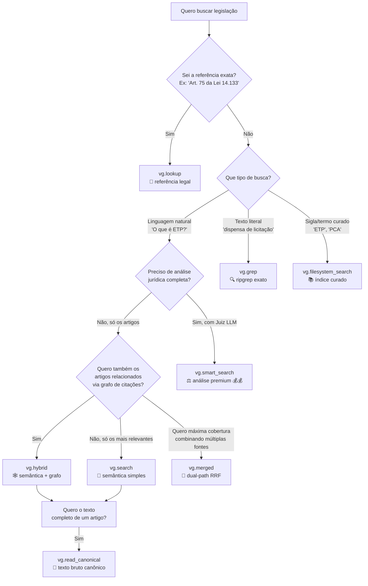

# Cheat Sheet — VectorGov SDK

> **TL;DR**: 23 métodos, 8 são de busca, o resto é apoio (tokens, audit, function calling, prompts, documentos). Esta página cabe em uma tela e responde **"o que posso fazer e qual método uso?"** sem você precisar abrir mais nada.

---

## ⚡ Setup em 30 segundos

```bash
pip install vectorgov
export VECTORGOV_API_KEY=vg_sua_chave
```

```python
from vectorgov import VectorGov

vg = VectorGov()  # lê VECTORGOV_API_KEY da env

result = vg.search("Quando o ETP pode ser dispensado?")

for hit in result:
    print(f"[{hit.score:.0%}] {hit.citation}")
    print(hit.text[:200], "...\n")
```

```
[97%] Art. 18 da Lei 14.133/2021
Art. 18. A fase preparatória do processo licitatório é caracterizada pelo planejamento ...

[92%] Art. 14 da IN 58/2022
Art. 14. A elaboração do ETP: I - é facultada nas hipóteses dos incisos I, II, VII e VIII ...
```

> 💡 **Dica para LLMs**: prefira sempre `hit.citation` em vez de `hit.source` — é a referência legal pronta no formato jurídico brasileiro (`Art. 75 da Lei 14.133/2021`). Cai para `hit.source` como fallback: `label = hit.citation or hit.source`.

---

## 🌳 Qual método de busca usar?



### Comparação rápida

| Método | Latência | Custo | Pra que serve |
|---|---|---|---|
| `vg.search()` | 2-7s | 💰 | Busca semântica simples — chat, RAG, autocomplete |
| `vg.smart_search()` | 5-18s | 💰💰 | Análise jurídica completa com Juiz LLM (Premium) |
| `vg.hybrid()` | 3-10s | 💰 | Semântica + expansão por grafo de citações |
| `vg.merged()` | 2-5s | 💰 | Dual-path: hybrid + filesystem com RRF |
| `vg.lookup()` | < 1s | 💰 | Resolve "Art. 75 da Lei 14.133" para o dispositivo |
| `vg.grep()` | < 1s | 💰 | Busca textual literal (ripgrep) |
| `vg.filesystem_search()` | < 1s | 💰 | Índice curado (siglas, termos técnicos) |
| `vg.read_canonical()` | < 1s | **free** | Lê texto canônico completo (sem busca) |

---

## 📋 Todos os 23 métodos em uma tela

### 🔍 Busca (8 métodos) — o coração do SDK

| Método | Retorna | Endpoint | Custo | Caso de uso |
|---|---|---|---|---|
| `search(query, mode, top_k, ...)` | `SearchResult` | `POST /sdk/search` | 💰 | Busca semântica padrão (3 modos) |
| `smart_search(query)` | `SmartSearchResult` | `POST /sdk/smart-search` | 💰💰 | Pipeline com Juiz LLM, dispositivos relacionados |
| `hybrid(query, hops)` | `HybridResult` | `POST /sdk/hybrid` | 💰 | Semântica + expansão por grafo de citações |
| `lookup(reference)` | `LookupResult` | `POST /sdk/lookup` | 💰 | Resolve "Art. 75 da Lei 14.133" → dispositivo exato |
| `grep(query)` | `GrepResult` | `POST /filesystem/grep` | 💰 | Busca textual exata via ripgrep |
| `filesystem_search(query, mode)` | `FilesystemResult` | `POST /filesystem/search` | 💰 | Índice curado determinístico |
| `merged(query, top_k)` | `MergedResult` | `POST /search/merged` | 💰 | hybrid + filesystem unificados via RRF |
| `read_canonical(doc_id, span_id)` | `CanonicalResult` | `GET /filesystem/read/{id}` | **free** | Lê texto canônico completo |

### 🤖 Function Calling (4 métodos) — para agentes LLM

| Método | Retorna | Custo | Caso de uso |
|---|---|---|---|
| `to_openai_tool()` | `dict` | **free** | Tool no formato OpenAI Function Calling |
| `to_anthropic_tool()` | `dict` | **free** | Tool no formato Anthropic Claude Tools |
| `to_google_tool()` | `dict` | **free** | Tool no formato Google Gemini |
| `execute_tool_call(tool_call)` | `str` | 💰 | Executa tool_call de qualquer LLM e retorna resultado |

### 📊 Tokens & Feedback (3 métodos)

| Método | Retorna | Custo | Caso de uso |
|---|---|---|---|
| `estimate_tokens(content)` | `TokenStats` | **free** | Estima tokens antes de enviar para LLM |
| `feedback(query_id, like)` | `bool` | **free** | Like/dislike de resultado (melhora futuras buscas) |
| `store_response(query, answer, ...)` | `StoreResponseResult` | **free** | Armazena resposta de LLM externo (opt-in) |

### 🎯 System Prompts (2 métodos)

| Método | Retorna | Custo | Caso de uso |
|---|---|---|---|
| `get_system_prompt(style)` | `str` | **free** | Prompt pré-otimizado: `default`, `concise`, `detailed`, `chatbot` |
| `available_prompts` (property) | `list[str]` | **free** | Lista os estilos disponíveis |

### 📚 Documentos (2 métodos)

| Método | Retorna | Endpoint | Custo | Caso de uso |
|---|---|---|---|---|
| `list_documents(page, limit)` | `DocumentsResponse` | `GET /sdk/documents` | **free** | Lista normas indexadas |
| `get_document(document_id)` | `DocumentSummary` | `GET /sdk/documents/{id}` | **free** | Metadados de uma norma específica |

### 🛡️ Auditoria & Compliance (3 métodos)

| Método | Retorna | Endpoint | Custo | Caso de uso |
|---|---|---|---|---|
| `get_audit_logs(severity, ...)` | `AuditLogsResponse` | `GET /sdk/audit/logs` | **free** | Logs de uso (security/performance/validation) |
| `get_audit_stats(days)` | `AuditStats` | `GET /sdk/audit/stats` | **free** | Estatísticas agregadas |
| `get_audit_event_types()` | `list[str]` | `GET /sdk/audit/event-types` | **free** | Lista tipos de evento disponíveis |

### 🛠️ Utilitário (1 método)

| Método | Retorna | Custo | Caso de uso |
|---|---|---|---|
| `close()` | `None` | **free** | Libera conexões HTTP. Use `with VectorGov() as vg:` para auto |

---

## 🍳 10 padrões idiomáticos

### 1. Iniciar o cliente (3 formas)

```python
# (a) API key na env (recomendado)
export VECTORGOV_API_KEY=vg_...
vg = VectorGov()

# (b) explícito
vg = VectorGov(api_key="vg_...")

# (c) context manager (auto-close)
with VectorGov() as vg:
    result = vg.search("...")
```

### 2. Iterar resultados com label legal

```python
result = vg.search("dispensa de licitacao")
for hit in result:
    label = hit.citation or hit.source  # 0.19.4+
    print(f"[{hit.score:.0%}] {label}\n{hit.text[:200]}\n")
```

### 3. Filtrar por score mínimo

```python
relevant = [h for h in result.hits if h.score >= 0.5]
```

### 4. Filtrar por norma específica

```python
result = vg.search(
    "credenciamento",
    document_id_filter="LEI-14133-2021",
)
```

### 5. Passar para qualquer LLM

```python
# Funciona em OpenAI, Anthropic, Gemini, Ollama (formato chat universal)
messages = result.to_messages(query="O que é ETP?")
response = openai_client.chat.completions.create(
    model="gpt-4o-mini",
    messages=messages,
)
```

### 6. Limitar contexto por tokens

```python
context = result.to_context(max_chars=4000)
# ou
stats = vg.estimate_tokens(result, query="...", system_prompt=vg.get_system_prompt())
if stats.total_tokens > 100_000:
    context = result.to_context(max_chars=20_000)
```

### 7. Resolver referência exata

```python
r = vg.lookup("Art. 75 da Lei 14.133")
print(r.match.citation)         # 'Art. 75 da Lei 14.133/2021'
print(r.stitched_text)          # caput + parágrafos + incisos consolidados
```

### 8. Function calling (OpenAI)

```python
tools = [vg.to_openai_tool()]
response = openai_client.chat.completions.create(
    model="gpt-4o",
    messages=[{"role": "user", "content": "Dispensa de licitação?"}],
    tools=tools,
)

# Se o LLM chamou a tool, executa
if response.choices[0].message.tool_calls:
    result_text = vg.execute_tool_call(response.choices[0].message.tool_calls[0])
```

### 9. Feedback para melhoria contínua

```python
result = vg.search("licitacao")
# ... usuário aprova ...
vg.feedback(query_id=result.query_id, like=True)
```

### 10. Auditoria por severidade

```python
critical = vg.get_audit_logs(severity="critical", limit=100)
for log in critical.logs:
    print(f"{log.timestamp} [{log.event_type}] {log.action_taken}")
```

---

## 🐛 Erros comuns e fixes

| Erro | Causa | Fix |
|---|---|---|
| `AuthError: API key inválida` | Key começando errado ou expirada | Tem que começar com `vg_`. Veja [Obter API Key](#) |
| `RateLimitError` | Plano free excedido | Aguarde 60s ou faça upgrade. `vg.get_audit_stats()` mostra uso |
| `hit.citation is None` | Cache legado pré-0.19.4 | Use fallback: `label = hit.citation or hit.source` |
| `m.span_id == ""` em `vg.grep()` | IDs internos não expostos no response público | Esperado. Use `m.citation or m.document_id` |
| `to_context()` com vírgula solta | Versão SDK < 0.19.5 | `pip install -U vectorgov` |
| `ImportError: vectorgov.langchain` | Extra não instalado | `pip install 'vectorgov[langchain]'` |
| `ValidationError: query muito curta` | < 3 caracteres | Mínimo 3 caracteres |
| `TimeoutError` em `smart_search` | Pipeline LLM lento | Aumente `timeout=180.0` no construtor |

---

## 🧭 Próximos passos

- 📖 [Reference técnica completa dos 23 métodos](api/methods.md) — assinatura, parâmetros, retorno, exceções
- 🧱 [Modelos de dados (Hit, SearchResult, etc.)](api/models.md)
- 🔌 [Integrações: OpenAI, Claude, Gemini, LangChain, LangGraph, Ollama, MCP](integrations/index.md)
- 🧠 [Guia de busca avançada](guides/advanced-search.md) — modos, filtros, dual-lane
- 🛡️ [Tratamento de erros](guides/error-handling.md)
- 📊 [Auditoria e compliance](guides/observability-audit.md)
- 🤖 [LLM reference (single-page para alimentar agentes)](llm-reference.md)
